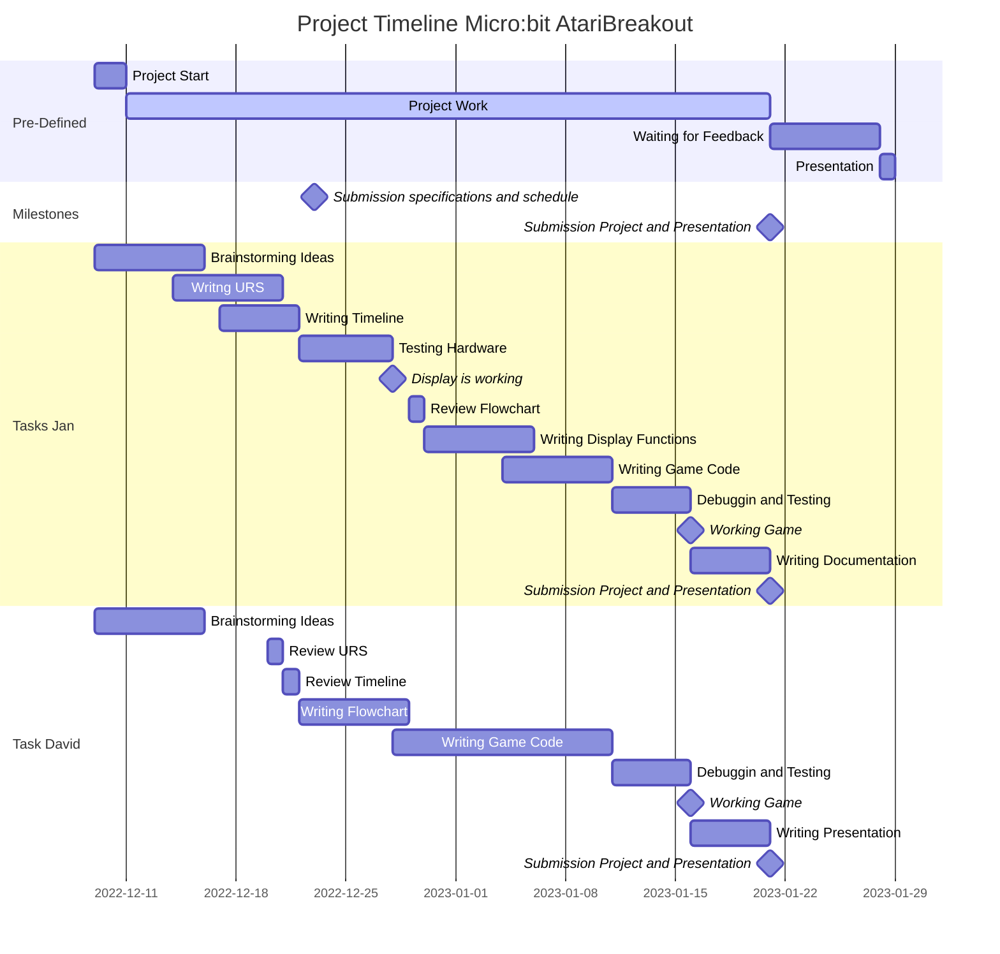

```mermaid
gantt
    title Project Timeline Micro:bit AtariBreakout
    dateFormat  YYYY-MM-DD

    section Pre-Defined
    Project Start: 2022-12-09, 2d
    Project Work:active, 2022-12-11, 41d
    Waiting for Feedback: 2023-01-21, 7d
    Presentation: 2023-01-28, 1d

    section Milestones
    Submission specifications and schedule :milestone, m1, 2022-12-23, 0d
    Submission Project and Presentation: milestone, m2, 2023-01-21, 0d

    section Tasks Jan
    Brainstorming Ideas: 2022-12-09, 7d
    Writng URS :2022-12-14, 7d
    Writing Timeline: 2022-12-17, 5d
    Testing Hardware: 2022-12-22, 6d
    Display is working:milestone, 2022-12-28, 0d
    Review Flowchart:  2022-12-29, 1d
    Writing Display Functions: 2022-12-30, 7d
    Writing Game Code: 2023-01-04, 7d
    Debuggin and Testing: 2023-01-11, 5d 
    Working Game: milestone, 2023-01-16, 0d
    Writing Documentation: 2023-01-16, 5d
    Submission Project and Presentation: milestone, m2, 2023-01-21, 0d


    section Task David
    Brainstorming Ideas: 2022-12-09, 7d
    Review URS :2022-12-20, 1d
    Review Timeline: 2022-12-21, 1d
    Writing Flowchart: 2022-12-22, 7d
    Writing Game Code: 2022-12-28, 14d
    Debuggin and Testing: 2023-01-11, 5d
    Working Game: milestone, 2023-01-16, 0d
    Writing Presentation: 2023-01-16, 5d
    Submission Project and Presentation: milestone, m2, 2023-01-21, 0d

```